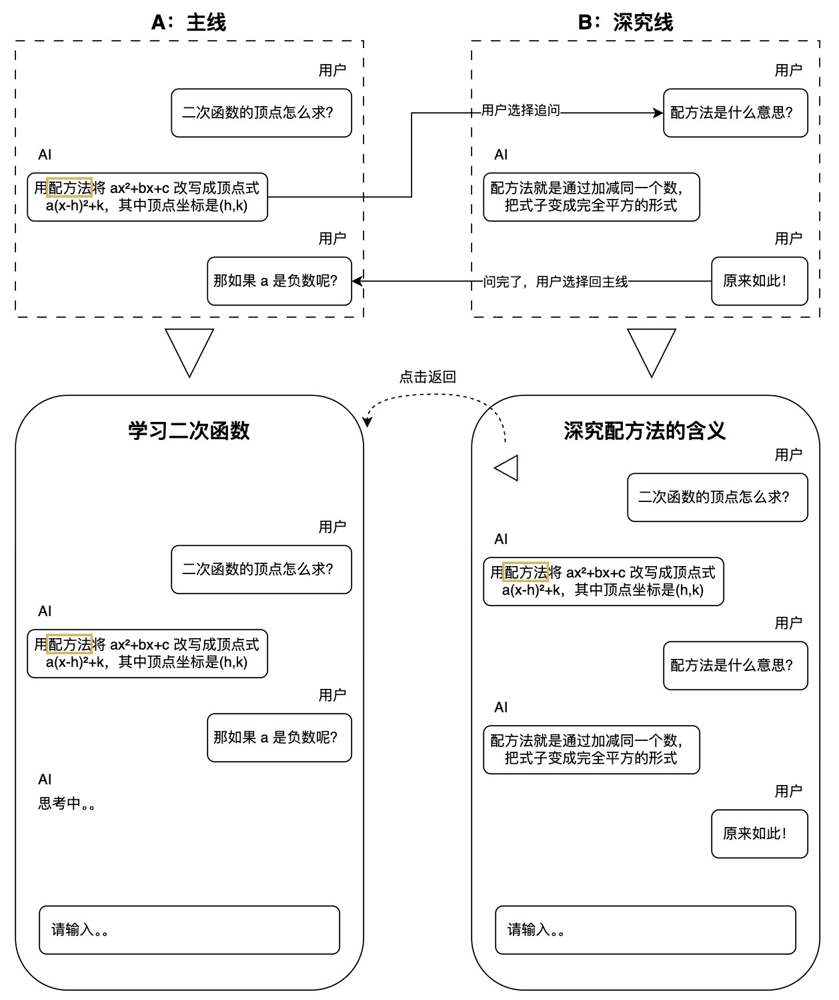

# 项目说明

## 项目概述
Project Ant 是一个面向自学者的 iOS/Mac AI 学习助手，通过树状分支、非线性、可深究的对话方式帮助用户攻克复杂知识点。（现在只做ios版本）

以下是通过 Pitch deck 结构编写的项目说明文档：
<!-- 在这里描述项目的基础情况：项目名称、定位、目标用户、核心功能等 -->

## 核心痛点 (Problem)

现有 AI 工具（如 ChatGPT、Claude）采用纯线性对话模式，在学习复杂内容（编程、数学等）时存在明显局限：

- 在当前对话中深究会打乱学习主线，难以定位知识点
- 开启新对话会丢失上下文，且难以管理多条对话线索

这导致自学者在遇到多个陌生概念时，无法有效地既保持学习主线，又深入探索细节。

## 解决方案 (Solution)

Project Ant 采用类似 Git 分支的树状对话结构，由三个核心模块组成：

- 主要目标：智能对话界面
- 尽量完成demo：学习路径可视化
- 有时间再做：知识掌握追踪（时间允许的情况下）

- **深究对话界面**（Deep-dive Chat）
    - 基础功能类似传统 AI 聊天
    - 核心创新：用户可选中 AI 回复中的任意部分进行深究
    - 深究会创建新的对话分支，继承父对话的完整上下文
    - 各分支相互独立，不会互相干扰
- **学习路径可视化**（Learning Tree）
    - 以树状图形式展示所有对话分支关系
    - 类似 GitHub 的分支视图，直观呈现知识探索路径
    - 支持在不同分支间快速切换和导航
- **知识掌握追踪**（Knowledge Tracker）（可选目标）
    - AI 自动识别对话中出现的知识点
    - 智能判断用户的掌握程度（待学习/学习中/已掌握）
    - 生成个性化的知识图谱和学习报告

## 深究对话界面示意

这里采用一个数学学习的例子来说明深究对话是什么：



## 学习路径可视化示意

ui可以先简单用这样的形式绘制（毕竟是MVP）：

```
根节点：解方程
│
├─ 分支1：一元二次方程怎么解？
│   │
│   └─ 分支1.1：二次函数的顶点怎么求？
│       │
│       ├─ 分支1.1.1：[深究"配方法"] 配方法是什么意思？
│       │   │
│       │   └─ 分支1.1.1.1：[深究"完全平方"] 完全平方是什么？
│       │
│       ├─ 分支1.1.2：[深究"顶点式"] 顶点式和标准式有什么区别？
│       │
│       └─ 分支1.1.3：[深究"a是负数"] 那如果a是负数呢？
│
└─ 分支2：[深究"一元二次方程"] 一元二次方程的判别式是干嘛的？
```

## 用户故事

**用户 1：自学 Python 的大学生**

> "我在学习 Python 列表时,AI 提到了'切片'这个概念。我想深入了解切片怎么用,但又担心问太多会偏离'列表'这个主题。如果我开新对话问切片,又会丢失之前关于列表的所有讨论内容,很难接上之前的学习进度。**我希望可以在深究'切片'的同时,不打乱学习'列表'的主线,并且随时能回到之前学习的位置继续。**"

**用户 2：准备期末考试的学生**

> "我在复习高等数学的求导时,发现自己对'极限'的理解不够扎实,想先搞懂极限。但如果在当前对话里深究极限,后面继续问求导时,对话记录会变得很乱,我都不记得刚才讲到求导的哪一步了。**我希望可以先把极限搞清楚,然后清楚地知道刚才求导学到哪一步了,能直接接着学下去。**"

**用户 3：学习理财的职场新人**

> "我在了解基金投资时,遇到了'市盈率''分红率''净值'等好几个概念。我想分别搞清楚每个概念,但如果一个一个在同一对话里问,很快就会混在一起;如果分别开新对话,又不知道这些概念和我最初想学的'基金投资'有什么关系,学完也串不起来。**我希望可以把每个概念都搞懂,同时清楚地看到它们和'基金投资'的关系,形成完整的知识体系。**"

## 技术栈

### 开发工具
- **IDE**: Xcode 写 Swift, VSCode 写 React Native
- **Vibe Coding 工具**: Xcode 的 Claude 或者 ChatGPT，需要简单配置
- **协作方式**: Xcode Vibe Coding（Live Coding）
- **版本控制**: GitHub

### 技术选型
<!-- 在这里列出需要的技术栈，例如： -->
- iOS 开发框架: SwiftUI / React Native
- 第三方库：LangChain 管理上下文
- AI 模型：OpenAI API
- 本地数据库（sqlite）：存储对话历史、学习路径、知识图谱等

## 工作流程

### 开发流程

目前还不确定工作量。如果需要协作，采用以下方式：

Lean Agile / Hackathon Style: 
1. **有空就聊**：简单同步一下想做什么，不强制开会
2. **随时提交**：写完一个小功能就提交，别攒太多
3. **能跑就行**：先把功能做出来，好不好看之后再说
4. **不要有bug**：确定功能可用后再提交

熟悉代码的组员会进行代码的审核和合并，确保主分支代码质量。

### GitHub 协作规范

- **分支策略**：
  - `main` 分支: 可运行的稳定版本
  - `dev/feature-` 分支: 开发分支
  - 支线名字: feature/xxx（如有需要再创建）

## 时间节点

- **报名截止日**：2025 年 11 月 10 日（周一）by EOD
- **Demo 时间**：2025 年 11 月 14 日（周五）
- **VC 比赛时间**：2025 年 12 月 3 日（周三）

---

> [!NOTE]
> 以下是补充的 Pitch Deck 内容。以下全部内容，都可以之后在PPT里随便修改。

## 市场情况 (Market)

### 市场规模

- **全球在线教育市场**：多家机构对在线教育市场口径存在差异，2024 年规模约 3,257–3,664 亿美元，主流预测至 2026 年接近 3,700–4,000 亿美元，年复合增长率约 8–20%+（取决于定义与子赛道）
- **中国在线教育市场**：中国 MOOC 注册用户 4.5 亿+（2024 年），在线学习需求持续增长；AI 教育工具作为新兴赛道快速发展
- **AI 学习助手赛道**：ChatGPT 周活跃用户从 2023 年 11 月的≥1 亿增长至 2025 年 10 月的≥8 亿，体现大模型在学习场景的快速渗透；Claude、Gemini 等竞品持续涌入

### 目标用户群体

1. **大学生**（核心用户）
   - 规模：2023 年中国高等教育在校生 4,763 万人（其中本专科 3,775 万、研究生 388 万）
   - 痛点：自学编程、数学、专业课，概念多且复杂
   - 付费意愿：中等（学生党预算有限，但愿意为提升学习效率付费）

2. **自学者/终身学习者**
   - 规模：中国 MOOC 注册用户 4.5 亿+（2024 年），覆盖大量职场人士和终身学习者
   - 痛点：转行学习新技能（编程、数据分析、设计等）
   - 付费意愿：高（职场人士，看重效率和效果）

3. **考试/备考人群**
   - 规模：2024 年考研报名 438 万人，2025 年国考通过资格审查 341.6 万人，合并其他考试总体为数千万级
   - 痛点：需要系统掌握知识体系，快速攻克薄弱点
   - 付费意愿：高（考试压力大，愿意投入）

### 市场趋势

- ✅ AI 工具从"通用对话"向"垂直场景"演进
- ✅ 用户对个性化、结构化学习的需求增加
- ✅ 移动学习快速增长（2024→2033 预期市场规模从 482.7 亿美元增至 2,785.2 亿美元），用于培训与碎片化学习的渗透率持续提升

## 竞争优势 (Competition & Differentiation)

### 竞品分析

| 产品 | 核心功能 | 优势 | 劣势 |
|------|---------|------|------|
| **ChatGPT / Claude** | 通用 AI 对话 | AI 能力强，知识覆盖广 | 纯线性对话，无法管理学习路径，深究会打乱主线 |
| **Notion AI** | 笔记+AI | 整合笔记和知识库 | 不专注学习场景，缺少学习路径管理 |
| **各类题库 App** | 刷题+讲解 | 针对考试优化 | 依赖题库，无法应对开放式学习需求 |
| **学习管理工具**（如 Anki） | 记忆曲线 | 巩固记忆效果好 | 需要手动制卡，无 AI 交互 |

### 我们的差异化优势

1. **树状对话结构** 🌳
   - 竞品：线性对话，深究会打乱主线
   - 我们：可随时创建分支深究，不影响主线学习

2. **学习路径可视化** 🗺️
   - 竞品：对话记录杂乱，难以回溯
   - 我们：树状图清晰展示知识探索路径，随时切换分支

3. **上下文继承机制** 🔗
   - 竞品：新对话丢失上下文
   - 我们：分支自动继承父对话上下文，保持连贯性

4. **移动端原生体验** 📱
   - 竞品：大多是 Web 应用，体验一般
   - 我们：iOS 原生 App，流畅度和交互体验更佳

### 护城河

- **产品设计创新**：树状对话+路径可视化的组合是独特的
- **先发优势**：抢占"非线性 AI 学习"这个细分赛道
- **用户习惯**：一旦用户习惯树状学习方式，迁移成本高

## 商业/收入模式 (Business Model)

### 盈利模式：订阅制 + 免费增值

#### 免费版（Free Tier）
- ✅ 基础对话功能
- ✅ 每天最多 3 个分支
- ✅ 保留最近 7 天的学习记录
- 🎯 目标：吸引用户，验证产品价值

#### 付费版（Premium）- ¥19.9/月 或 ¥199/年
- ✅ 无限分支创建
- ✅ 永久保存学习记录
- ✅ 学习路径可视化（高级图表）
- ✅ 知识掌握追踪 + 学习报告
- ✅ 优先使用最新 AI 模型
- ✅ 导出学习笔记（PDF/Markdown）

#### 教育机构版（Enterprise）- 定制报价
- 面向学校、培训机构
- 批量账号管理
- 学习数据分析后台
- 定制化课程路径

### 营收预测（乐观估计）

**第一年目标**：
- 用户获取：10,000 注册用户
- 付费转化率：5%（500 付费用户）
- 月订阅收入：500 × ¥19.9 = ¥9,950/月
- 年订阅收入：按 ¥199/年，约 ¥10 万/年
- **第一年总收入**：¥10-15 万

**第二年目标**：
- 用户规模：50,000 注册用户
- 付费转化率：8%（4,000 付费用户）
- **第二年总收入**：¥80-100 万

### 成本结构

- **AI API 成本**：OpenAI/Anthropic API 费用（按用量计费）
- **开发成本**：团队人力成本（初期以自己为主）
- **服务器成本**：云存储、数据库（初期较低）
- **营销成本**：App Store 推广、社交媒体运营

### 未来拓展方向

- 📚 **内容生态**：引入优质学习内容创作者
- 🤝 **B2B 合作**：与在线教育平台、学校合作
- 🌍 **国际化**：拓展英文市场
- 🎓 **垂直场景**：专门针对考研、编程面试等场景的定制版

## 团队介绍
待写


